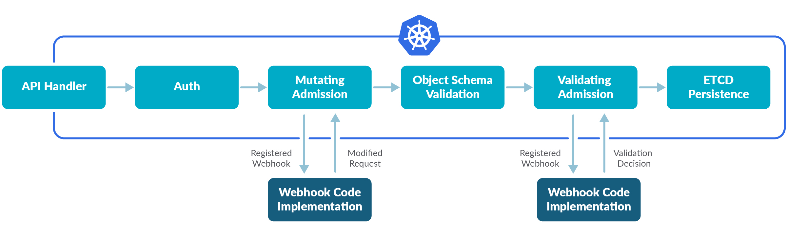

# generic-webhook-controller

Source: https://developers.redhat.com/articles/2021/09/17/kubernetes-admission-control-validating-webhooks#bootstrap_with_the_operator_sdk



### Generate controller scaffold
```bash
$ operator-sdk init --domain cfy.cz --repo github.com/Cloud-for-You/generic-webhook-controller
```

### Configure router / Add path
Routes can be configured in the *main.go* file
